# 💻 Lee Jia Sheng

**`CS Student | Software Developer`**

## About Me 

I'm a CS undergrad majoring in AI, passionate about building software, solving problems and learning new things in general. 😉

- I'm into full stack and AI development, as well as DevOps
- Currently exploring Golang, Svelte, and Rust
- Learning system design concepts, especially microservices architecture.

## Tech Stack

## Github Stats

## Let's Connect

